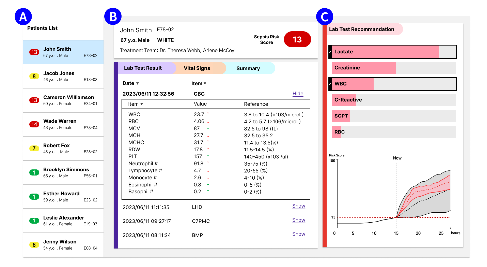

## 1.数据

mimic3 mimic4的csv，pineline，代码上传到github上

额外资料：205服务器/home/lnsdu/tys/data/mimiciii/ADMISSIONS.csv

## 2.图形界面（demo）

（面对医生的产品）

图 ：我们的原型系统的用户界面。（A） 具有不同脓毒症风险预测评分的患者列表，从无风险为绿色，到中等风险为黄色，到高风险为红色。（B） 患者的人口统计数据和仪表板，其中包括患者的生命体征、实验室测试结果和病史。（C） 我们的 SepsisLab 系统作为现有 EHR 系统的附加组件。此 UI 当前显示，临床专家正在检查 15 小时前入院的高危患者的数据。AI 建议专家收集更多实验室结果。专家正在与可视化进行交互，以查看是否添加了乳酸和 WBC 实验室结果，脓毒症预测及其不确定性将如何变化。此屏幕截图中的所有患者姓名和人口统计信息都是随机生成的用于说明目的的虚假数据。

## 3.如何微调大模型

huggingface，finetune llm

[microsoft/biogpt · Hugging Face](https://huggingface.co/microsoft/biogpt)

学习怎么使用语料去微调大模型

第一步：自己设计prompt语料库，当做训练集

第二步：微调大模型

## 4.RAG （选做）

 https://getliner.com/

## 5.使用服务器